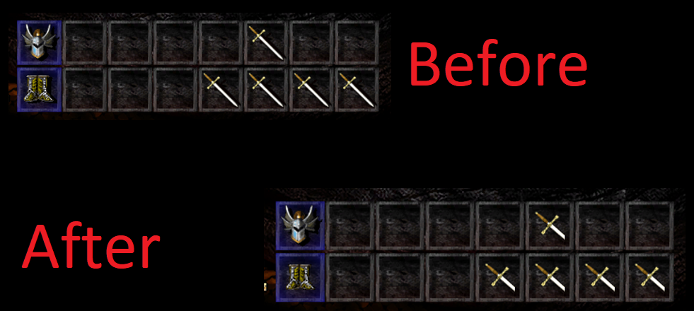

# Infinity Engine Enhanced Editions Icon Fix

The Enhanced Editions of Baldurs Gate, Baldurs Gate 2, Icewind Dale and Planescape Torment all suffer from a strange issue where inventory items will always use the "large" version of the icon.

Basically, each icon actually has 2 icons. When it's in an inventory square, it will have a mostly-square, zoomed in version that focuses mostly on some core feature of the item, such as the hilt. When the item is picked up with the mouse, a larger, full version of the item appears. The Enhanced Edition always uses this larger version of the icon, even when the item is in the inventory, which can look nice sometimes but can also make it much harder to make out various details. For instance, it's very hard to tell the difference between a long sword and a bastard sword.

The original icons were included in the Enhanced Editions, but are deactivated. This WeiDu script modifies the icon files to use the originals again.

This will work for items added by mods, as long as those items have the same issues (such as, if the icon was taken from another EE game) and follow the standard INAME.BAM and GNAME.BAM conventions.

More about this issue is available at this thread:
https://forums.beamdog.com/discussion/41397/do-the-new-item-icons-suck-in-baldurs-gate

You can see the difference below:

